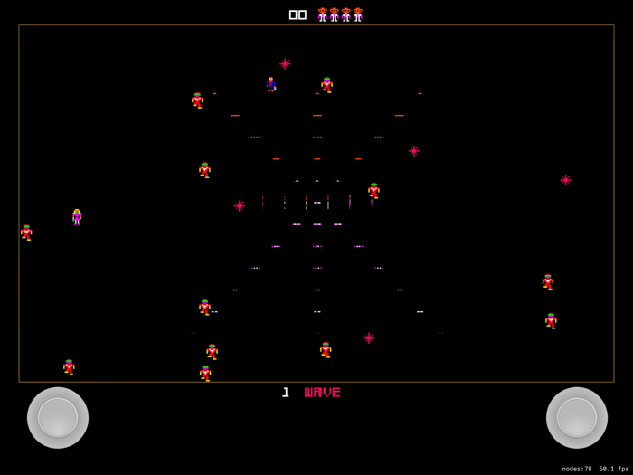

# Robotron

An implementation of the classic Robotron 2084 game for the iPad and Mac.  This is a game I
played a lot in my 20's and really enjoyed.  I am using this project to learn SpriteKit and
to have a little fun.

Robotron is a devishly hard game from the 1980s that introduced the notion of using two joysticks, one controlling movement and the other controlling firing.  Rather than explain the game here, you can go to one of the many sites on the web that reviews the game.  The [Robotron Guidebook](http://www.robotron2084guidebook.com) is very good.  You can also search for Robotron on YouTube to see the game being played on the original machine.

## Controller Support

You can use a PS or XBox wireless controller with Robotron.  Just connect the controller to your device and then launch Robotron.

An on-screen controller appears on iPad if a wireless controller cannot be found.  On the mac, you can connect a suppored USB controller, but some sort of controller is required.

